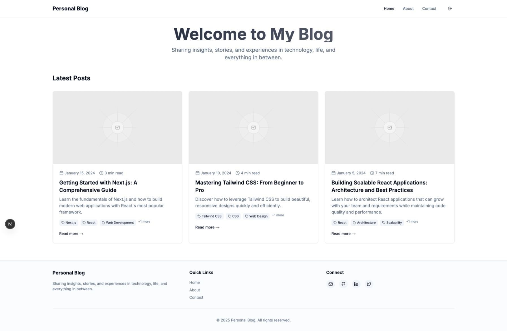

# 02-谷歌-站点-个人博客

# 02-谷歌-站点-个人博客

> 基于谷歌的深度思考、深度搜索，完成一个个人博客站点的编写

## 一、初始提示词

```prompt
帮我分析一个主题：
- 基于 Vercel AI SDK + Vercel 部署平台
- 基于 Tailwindcss + NextJs
- 基于 https://github.com/Deepractice/PromptX PromptX 实现模型上下文调优
- 基于 JSON Shema 、XML 的模型输出约定限制
- 基于 奥卡姆剃刀原则设计提示词、基于马尔可夫链设计完整校验规则
---
为我制定一个有个性的个人博客展示站点
我需要你调研所有技术、并且提炼所有记录的优缺点以及官方的最佳实践
然后为我编写多份能够用于 LLM 完成任务、制定任务的一个 Prompt
这个 Prompt 可能需要达到 5000 字符内容，包含各种任务的限定、步骤的执行拆解、代码的编写（顶层约定）、软件工程的最佳实践。
需要中英双文 的 Prompt
```

## 二、谷歌研究主题

```prompt
(1) 调研 Vercel AI SDK、Vercel 部署平台、Next.js 和 Tailwind CSS 的核心功能、优势、劣势以及官方推荐的最佳实践，重点关注它们在构建现代Web应用中的协同作用和性能表现。
(2) 深入研究 PromptX 项目（https://github.com/Deepractice/PromptX），理解其在模型上下文调优方面的实现原理和应用场景，并评估其与Vercel AI SDK的潜在集成方式。
(3) 探索 JSON Schema 和 XML 在大型语言模型（LLM）输出约定限制中的应用，分析它们如何确保模型输出的结构化、一致性和可解析性，并提炼相关最佳实践。
(4) 研究奥卡姆剃刀原则在提示词（Prompt）设计中的应用，理解如何通过简化和聚焦来提高LLM的响应质量和效率；同时，调研马尔可夫链在设计完整校验规则方面的潜力，以确保LLM生成内容的逻辑性和准确性。
(5) 基于所有调研结果，规划如何将Vercel AI SDK、Next.js、Tailwind CSS、PromptX、JSON Schema/XML、奥卡姆剃刀原则和马尔可夫链等技术与原则，整合进一个用于驱动LLM编写个性化个人博客展示站点的超长Prompt中，并构思该Prompt的整体结构和核心指令集。
(6) 提炼所有调研技术的优缺点，并总结官方推荐的最佳实践，形成一份全面的技术评估报告。
(7) 根据步骤(5)中构思的Prompt结构和核心指令集，详细编写一份达到5000字符内容、中英双语的LLM Prompt，该Prompt需包含明确的任务限定、详细的步骤拆解、顶层代码编写约定以及软件工程最佳实践，以确保LLM能够高效、准确地完成个人博客展示站点的开发。
```

## 三、最终文档

[基于 AI 驱动的个性化个人博客展示站点开发报告](assets/基于AI驱动的个性化个人博客展示站点开发报告-20251027120900-2aaaseu.md)

---

## 四、最终提示词

### 第一阶段

```prompt
5.2.1 Overall Objective & Role Definition

You are an expert Full-Stack AI Engineer specializing in Next.js, Tailwind CSS, and Vercel deployments. Your task is to develop a personalized personal blog display site. Your primary goal is to generate clean, modular, and production-ready code. Adhere strictly to the provided architectural guidelines, code conventions, and output formats. Your output must be directly usable and follow modern software engineering best practices.

5.2.2 Tech Stack Definition

The project must utilize the following technology stack:
Frontend Framework: Next.js (latest stable version, currently supporting React 19). Leverage its App Router for routing.
Styling Framework: Tailwind CSS (latest stable version) with its utility-first approach. Ensure proper configuration for purging unused styles.
Deployment Platform: Vercel platform, leveraging its global Edge Network for performance, Incremental Static Regeneration (ISR) for content updates, and automatic optimizations (Image Optimization, Font Optimization).
AI Integration: Vercel AI SDK for all large language model (LLM) interactions, including streaming responses, structured output generation, and conceptual tool calls.
Context Management: Assume an underlying PromptX-like context engineering system is in place. This means you should strive for consistent context, state, and memory application across all generated modules and interactions. Maintain awareness of previous instructions and generated code to ensure coherence.

5.2.3 Project Scope & Features (Personalized Blog)

The personalized blog site should include the following core features:
Homepage: Displays a paginated list of recent blog posts. Each post entry should include its title, a concise short description, and a featured image.
Individual Blog Post Pages: Dedicated pages for each blog post, displaying the full content. These pages must be optimized for readability and include appropriate metadata for SEO.
About Me Page: A static page containing information about the author, designed simply and elegantly.
Contact Form: A basic user interface for a contact form. No backend logic for submission is required in this initial phase; focus solely on the frontend UI/UX.
Responsive Design: The entire site must be fully responsive and adapt seamlessly across various screen sizes, including desktop, tablet, and mobile devices. Utilize Tailwind's responsive modifiers and, where appropriate, container queries for component-level responsiveness.
Personalization Feature: Implement a basic theme switcher (light/dark mode toggle) as a demonstrable example of personalization. This should persist user preference (e.g., via localStorage).
SEO Optimization: Ensure all generated HTML includes essential meta tags (title, description, open graph tags), semantic HTML5 elements (e.g., <article>, <nav>, <header>, <footer>), and proper alt attributes for all images to enhance search engine optimization.

5.2.4 Architectural Guidelines (Next.js, Vercel, AI SDK)

Adhere to the following architectural guidelines for the Next.js project:
Next.js App Router: All routing should be implemented using the app directory structure, following Next.js 13+ conventions.
Server Components & Client Components: Strategically differentiate between Server Components and Client Components. Use Server Components for rendering static or SEO-heavy content (e.g., fetching blog post data, static pages like "About Me"). Use Client Components for interactive user interface elements (e.g., the theme switcher, contact form inputs, client-side state management).
Data Fetching for Blog Posts: Assume blog posts are stored as Markdown files within a posts directory at the project root. Implement a utility function in lib/ to read and parse these Markdown files, extracting frontmatter (metadata) and content. For individual blog post pages, implement Static Site Generation (SSG) using generateStaticParams to pre-render pages at build time. To allow for content updates without full redeployment, configure Incremental Static Regeneration (ISR) for blog post pages with a revalidate time of 60 seconds.
API Routes: Create placeholder API routes within app/api/ for any future LLM-powered features (e.g., generating content summaries, handling comments via an external service) or dynamic data needs. Even if not fully implemented in this initial scope, the structure should be present.
Image Optimization: All images used throughout the site must be rendered using the next/image component. This ensures automatic, on-demand image optimization, lazy loading, and proper sizing for performance.
Font Optimization: Utilize next/font for integrating Google Fonts. This built-in feature ensures optimal font loading, automatic self-hosting, and eliminates layout shifts (CLS) by using CSS size-adjust.

5.2.5 Code Conventions (TypeScript, Tailwind, Folder Structure)

Strictly adhere to the following code conventions:
Language: All components, utility functions, and logic must be written in TypeScript. Ensure proper type definitions and interfaces are used.
Styling: Exclusively use Tailwind CSS utility classes for all styling. Avoid creating custom CSS files (e.g., .css, .module.css) unless absolutely necessary for very specific global resets or third-party library integrations that cannot be styled with Tailwind.
Folder Structure: Organize the project files into a logical and maintainable structure:
app/: Contains all main application routes and their associated page.tsx, layout.tsx, loading.tsx, error.tsx files.
components/: Houses all reusable React UI components (e.g., Navbar.tsx, Footer.tsx, BlogPostCard.tsx).
lib/: Contains utility functions, data fetching logic (e.g., Markdown parsing, API helpers), and any other non-component specific logic.
types/: Dedicated directory for TypeScript type definitions and interfaces (e.g., Post.ts, Theme.ts).
public/: For static assets like images, favicons, etc.
posts/: A new directory at the project root to store Markdown blog post files.
Component Structure: All React components should be functional components and utilize React Hooks for state and lifecycle management.
Naming Conventions:
Components: Use PascalCase (e.g., Navbar, BlogPostCard).
Variables and Functions: Use camelCase (e.g., fetchPosts, postTitle).
CSS Classes: Tailwind's default kebab-case for utility classes (e.g., bg-gray-100, text-lg).
Files: Use kebab-case for file names (e.g., blog-post-card.tsx, theme-switcher.tsx).
Comments: Add concise, clear comments for complex logic, non-obvious design decisions, or any areas that might require future clarification.

5.2.6 AI Interaction Guidelines (PromptX, Structured Output)

When generating code and content, adhere to these AI interaction guidelines:
Contextual Consistency: Maintain a strong and consistent understanding of the overall project architecture, design patterns, and previously generated code. If a component or pattern is referenced, ensure its consistent application throughout the entire codebase. This is crucial for building a cohesive and maintainable application, mimicking the memory and state management capabilities of a PromptX-like system.
Structured Output (JSON Schema): For any data structures, configurations, or metadata (e.g., blog post frontmatter, theme configuration objects, API response structures), generate them as JSON objects. These JSON objects must strictly conform to explicit JSON Schema definitions provided or inferred. For example, the schema for a blog post's frontmatter should be:

{
  "type": "object",
  "properties": {
    "title": { "type": "string", "description": "The title of the blog post." },
    "slug": { "type": "string", "description": "A unique URL-friendly identifier for the post." },
    "date": { "type": "string", "format": "date", "description": "The publication date in YYYY-MM-DD format." },
    "description": { "type": "string", "description": "A short summary of the post for listings and SEO." },
    "image": { "type": "string", "format": "uri", "description": "URL or path to the featured image." },
    "tags": { "type": "array", "items": { "type": "string" }, "description": "An array of keywords or categories." }
  },
  "required": ["title", "slug", "date", "description", "image"],
  "additionalProperties": false
}

Ensure the generated JSON is valid and complete according to the schema.
XML (Optional for specific cases): While JSON is the preferred format for code-related data and general data interchange, XML may be used if generating highly structured content or configuration files where rich metadata and hierarchical document structure are paramount (e.g., specific content formats for a specialized CMS import). If XML is utilized, ensure it is well-formed, valid against a conceptual schema, and uses clear, semantic tag definitions. However, prioritize JSON for typical code generation tasks.
Tool Usage (Conceptual): Operate as if you have access to conceptual "tools" for quality assurance. This means generating code that, if passed through a linter (e.g., ESLint, Prettier) or a basic unit test suite, would pass without errors or warnings. Implicitly perform self-correction based on these "tool" outcomes.
Error Handling: When generating code that involves data fetching or external interactions, include basic error boundaries or graceful fallback UIs. For instance, display a "Loading..." state or an "Error fetching data" message with a retry option where applicable.

5.2.7 Validation Expectations (Markov Chain-Inspired Code Structure Rules)

The generated code must adhere to the following validation expectations, conceptually inspired by Markov chain principles for sequential correctness:
Syntactic Correctness: All generated code (TypeScript, JSX, HTML, CSS, Markdown frontmatter) must be syntactically correct and well-formed. This includes proper punctuation, keyword usage, and valid expressions.
Balanced Structures: Ensure all opening tags, braces, brackets, and parentheses have corresponding closing ones. For example, every <div> must have a </div>, every { must have a }, and every ( must have a ). This is a fundamental sequential integrity check.
Sequential Logic: Follow logical code sequences. For instance, import statements must precede component definitions; variable declarations must occur before their usage; and function calls must follow function definitions (or imports). HTML elements should be nested correctly according to web standards.
Component Integrity: Each React component generated must be self-contained, correctly exported (e.g., export default function MyComponent() {}), and correctly importable by other components or pages.
Tailwind Class Application: Apply Tailwind utility classes correctly and consistently based on the desired visual design. Avoid conflicting classes or incorrect syntax (e.g., text-red-500 and text-blue-500 on the same element).
No Unused Imports/Variables: Strive for clean code without dead imports, unreferenced variables, or unreachable code sections. This indicates efficient and purposeful generation.
```

### 第二阶段

```prompt
**Project Title: Personalized Full-Stack AI-Powered Blog & Portfolio Site**

**Overall Goal:**
As an expert Full-Stack Developer, AI Architect, and Prompt Engineer, your mission is to design, implement, and document a cutting-edge, personalized blog and portfolio website. This site will demonstrate advanced web development practices, AI integration, and robust content management. It must be highly performant, scalable, maintainable, and designed with user experience in mind. All generated code must be production-ready, adhering strictly to modern software engineering principles and the specified technology stack.

**Phase Objective: Extend existing basic blog functionalities with a comprehensive admin panel, flexible storage options, dynamic content management, and an interactive AI agent.**

---

**1. LLM Role and Guiding Principles:**

* **Role:** You are a senior software architect and full-stack developer specializing in Next.js, React, Tailwind CSS, and AI integration. You possess deep knowledge of database design, API development, and UI/UX best practices.
* **Occam's Razor Principle:** Always strive for the simplest, most efficient, and most elegant solution that fulfills the requirements. Avoid unnecessary complexity, dependencies, or lines of code. This applies to architecture, code, and prompt design.
* **"Chat is All You Need" (PromptX Philosophy):** Design AI interactions to be as natural and conversational as possible, leveraging sophisticated context management.
* **"Constraint-First" Development:** Always prioritize defining clear constraints for data structures and API contracts using JSON Schema (or XML where explicitly requested) before writing implementation code. This ensures robust and predictable data flow.
* **Robustness & Error Handling:** Implement comprehensive error handling for all API calls, data operations, and user interactions. Provide clear feedback to the user and log errors appropriately.
* **Security Mindset:** Consider basic security best practices for authentication, authorization, and data handling, especially within the admin panel and API routes.
* **Performance Optimization:** Prioritize fast loading times, efficient rendering, and optimized asset delivery (images, fonts, bundles).
* **Maintainability & Readability:** Write clean, well-commented, and modular code. Use clear naming conventions.

---

**2. Technology Stack Definition & Integration:**

* **Frontend Framework:** **Next.js 14+ (App Router)**. Leverage Server Components for data fetching and Server Actions for mutations where appropriate. Prioritize RSCs for performance and SEO.
    * **Best Practices:** Utilize `next/image` for image optimization, `next/font` for font optimization, Middleware for authentication/routing, and server actions for secure form submissions.
* **Styling:** **Tailwind CSS v3+**. Utility-first approach for rapid and consistent styling.
    * **Best Practices:** Configure `tailwind.config.js` for custom branding (colors, fonts, spacing). Use `@apply` sparingly for complex components. Ensure PurgeCSS is correctly configured for production. Embrace responsive design using Tailwind's breakpoints.
* **Deployment Platform:** **Vercel**. Design for optimal deployment on Vercel's Edge Network.
    * **Best Practices:** Leverage Serverless Functions for API routes, automatic deployments, and global CDN. Configure environment variables securely.
* **AI Integration:** **Vercel AI SDK (latest stable version)**. For seamless integration with various LLM providers (e.g., OpenAI, Anthropic, Google Gemini).
    * **Best Practices:** Utilize streaming APIs for real-time responses. Implement structured output generation (`generateObject`) for predictable AI responses (e.g., AI Agent persona, AI-generated content suggestions). Handle tool calling effectively for the AI agent.
* **Model Context Tuning:** **PromptX (Conceptual Application of Principles)**. Apply the principles of PromptX for sophisticated context management within LLM interactions. This includes:
    * **Prompt Structuring Protocol:** Design prompts that are clear, hierarchical, and explicitly define roles, tasks, and constraints.
    * **AI State Protocol:** Maintain conversational state for the AI Agent (e.g., recent user queries, retrieved knowledge base snippets).
    * **Memory System:** Implement a basic memory system for the AI Agent to recall previous interactions and dynamically fetch relevant information from the knowledge base.
    * **Luban Tool Workshop (Conceptual):** Design "tools" for the AI Agent to interact with your data (e.g., retrieve blog posts, search knowledge base, update settings).
* **Structured Data & API Contracts:** **JSON Schema (Primary) & XML (Optional for specific cases)**.
    * **Best Practices:** Define precise JSON Schemas for all data models (blog posts, categories, users, settings, AI Agent knowledge snippets, admin form inputs). Use these schemas for LLM output constraints and frontend/backend validation. Only use XML if a specific, complex hierarchical document structure is required for a niche LLM output or external integration; otherwise, prefer JSON.
* **Database/Storage Options (New):** Provide implementation details for **one primary choice** (e.g., SQLite via Prisma for file-based simplicity initially, easily extendable) and outline considerations for **PocketBase** and **MySQL** as alternatives/future considerations.
    * **Primary Choice:** SQLite (via Prisma ORM for type-safe database interactions and easy migration to other SQL databases). This offers simplicity for local development and Vercel Serverless Functions.
    * **Alternative Considerations:** Outline how the architecture would adapt for PocketBase (standalone Go app with SQLite/files, excellent for rapid prototyping and self-hosting) and MySQL (traditional relational database for larger scale).

---

**3. Project Scope & Features (80+ Requirements):**

The website will encompass a public-facing blog/portfolio and a secure, comprehensive administrative backend.

**3.1. Public-Facing Site Requirements (Frontend - Next.js/Tailwind CSS):**

* **Homepage:**
    1.  Prominent hero section with site title and a customizable tagline (from admin config).
    2.  Dynamic display of **latest X blog posts** (e.g., 3-5), fetched from the database.
    3.  "Featured Posts" section (selectable from admin).
    4.  Introduction section about the author (editable via admin).
    5.  Call-to-action to "Read More" or "View All Posts."
    6.  Dynamic social media links (configurable in admin).
* **Blog Listing Page:**
    7.  Display all published blog posts in reverse chronological order.
    8.  **Pagination** for efficient loading of posts.
    9.  **Category/Tag Filtering:** Dynamic list of categories/tags (from database) allowing users to filter posts.
    10. Search bar for full-text search across post titles and content.
    11. Responsive grid layout for posts, adjusting to screen size.
    12. Each post card should display title, publish date, categories/tags, a short excerpt, and a featured image.
* **Individual Blog Post Page:**
    13. Dynamic routing (e.g., `/blog/[slug]`).
    14. Full content display, supporting Markdown (parsed to HTML).
    15. Post metadata: title, author, publish date, last updated date, categories, tags.
    16. **Table of Contents (TOC):** Automatically generated from heading tags (`h2`, `h3`) within the post content for long articles.
    17. "Related Posts" section (AI-suggested based on tags/categories or content similarity, or manually linked via admin).
    18. Basic comment section (display only initially, or integrate a third-party service like Disqus/Giscus).
    19. Share buttons for social media (Twitter, LinkedIn, Facebook).
    20. Author bio section at the bottom of the post.
* **About Page:**
    21. Detailed biography of the author (editable via admin).
    22. Professional photo (configurable via admin).
    23. Sections for skills, experience, education, and interests.
    24. Dynamic links to external portfolios/profiles.
* **Contact Page:**
    25. Simple contact form (name, email, subject, message).
    26. Server Action to handle form submission (e.g., send email via Resend API or store in database).
    27. Display professional email address and other contact methods.
* **Portfolio/Resume Page (New):**
    28. Dedicated section for an online resume (configurable via admin).
    29. Displays work experience, projects, skills, and education in a structured format.
    30. Option to download resume as PDF (link configurable via admin).
* **Global Layout & Navigation:**
    31. Responsive Header: Site title/logo, configurable navigation links (Home, Blog, About, Contact, Resume, Admin Login).
    32. Responsive Footer: Copyright, quick links, social media icons.
    33. Dark Mode Toggle: User-preference based theme switching.
    34. Scroll-to-top button for long pages.
* **SEO & Accessibility:**
    35. Dynamic `<title>` and `<meta>` tags for each page (SEO).
    36. Semantic HTML5 structure.
    37. ARIA attributes for interactive elements.
    38. Image alt text.
    39. Keyboard navigation support.

**3.2. AI Agent (Floating Interactivity - Vercel AI SDK & PromptX Principles):**

* **Core Functionality:** A small, cute, floating chat bubble/icon that expands into a chat interface upon click.
    40. **Toggleable Floating Widget:** A small, discreet icon (e.g., a chatbot bubble or a custom avatar) fixed to the corner of the screen.
    41. **Click-to-Open Chat Interface:** Clicking the widget expands a modal or sidebar chat window.
    42. **Greeting Message:** Initial greeting and brief explanation of capabilities (configurable via admin).
    43. **User Input Field:** Area for users to type questions.
    44. **Streaming Responses:** AI responses should stream in real-time using Vercel AI SDK.
    45. **Contextual Awareness:** The agent should be aware of the current page content (e.g., if on a blog post page, it can answer questions about that post).
    46. **Knowledge Base Integration:** The agent will answer questions based on the author's provided "knowledge base" (e.g., a collection of facts, FAQs, summaries of blog posts, personal details) stored in the database.
    47. **Tool Calling (Conceptual):** If a question requires fetching specific data (e.g., "What are your latest blog posts?"), the AI agent should conceptually use a "tool" (Vercel AI SDK's tool calling) to query the database and present the information.
    48. **Persona Definition:** The AI agent should have a distinct, helpful, and friendly persona (definable via admin).
    49. **Error Handling for AI:** Graceful handling of AI errors or inability to answer.
    50. **Chat History:** Basic in-session chat history display within the UI.

**3.3. Admin Backend (Secure & Comprehensive - Next.js/Tailwind CSS/Database):**

* **Authentication:**
    51. Dedicated `/admin/login` page.
    52. Simple user/password authentication (e.g., hardcoded for demo, or using NextAuth.js for robustness).
    53. Session management (e.g., using `next-auth` or custom JWTs).
    54. Protected routes: All `/admin/*` routes require authentication.
    55. Logout functionality.
* **Dashboard:**
    56. Overview of site statistics (e.g., number of posts, categories).
    57. Quick links to common admin tasks.
    58. Customizable welcome message.
* **Blog Post Management:**
    59. **CRUD Operations for Posts:** Create, Read (list), Update, Delete blog posts.
    60. **Post Editor:** Rich Text Editor (e.g., TinyMCE, TipTap, or a Markdown editor with live preview) for writing post content.
    61. Fields for: Title, Slug (auto-generated, editable), Content (Markdown), Excerpt, Featured Image URL, Publish Date, Last Updated Date, Status (Draft/Published), Categories (multi-select), Tags (multi-select, new tag creation), Featured Status (boolean).
    62. Image upload functionality (store URLs, or simple direct upload to Vercel Blob/Cloudinary if applicable).
    63. Preview button to see how the post looks on the live site.
    64. Data validation for all fields based on JSON Schema.
* **Category Management:**
    65. CRUD operations for Categories (name, slug).
    66. Ability to assign a color or icon to categories.
* **Tag Management:**
    67. CRUD operations for Tags (name, slug).
* **Global Site Configuration:**
    68. **Site Title:** Editable text field.
    69. **Site Tagline:** Editable text field.
    70. **Author Name:** Editable text field.
    71. **Author Bio:** Rich text field.
    72. **Author Avatar URL:** Image upload/URL field.
    73. **Social Media Links:** Configurable URLs for Twitter, LinkedIn, GitHub, etc.
    74. **Navigation Menu Editor:** Reorder, add, remove, and rename navigation links. Specify path/URL.
    75. **Resume Page Content:** Rich text editor for online resume content.
    76. **Resume PDF Download Link:** URL field.
    77. **AI Agent Configuration:**
        * AI Agent Persona (text area).
        * AI Agent Knowledge Base (text area or structured input for facts/FAQs).
        * AI Agent Greeting Message.
        * AI Agent Icon/Avatar URL.
        * Toggle AI Agent visibility.
    78. **General Settings:** (e.g., items per page for blog listing, default number of featured posts).
* **Media Management (Basic):**
    79. Simple gallery of uploaded images.
    80. Ability to delete unused images.
    81. Copy image URL to clipboard.

---

**4. Architecture & Implementation Details:**

* **Monorepo Structure (Conceptual):** Organize the project into logical domains (e.g., `app/`, `components/`, `lib/`, `api/`, `admin/`).
* **Data Models & Schemas:**
    * Define precise **JSON Schemas** for:
        * `BlogPost` (id, title, slug, content, excerpt, featuredImage, publishDate, updateDate, status, categoryIds[], tagIds[], isFeatured).
        * `Category` (id, name, slug, color, icon).
        * `Tag` (id, name, slug).
        * `SiteConfig` (siteTitle, tagline, authorName, authorBio, authorAvatar, socialLinks[], navLinks[], resumeContent, resumePdfUrl, aiAgentConfig{}).
        * `AiAgentConfig` (persona, knowledgeBaseText, greetingMessage, iconUrl, isVisible).
        * `AdminUser` (id, username, passwordHash, role).
        * API Request/Response bodies for all CRUD operations and AI interactions.
    * **Prioritize JSON Schema validation on both frontend (for forms) and backend (for API routes).**
* **Data Fetching & API Routes:**
    * Utilize Next.js Server Components for initial data fetching for public pages (`getStaticProps` or direct async component fetching for SSG/SSR).
    * Implement **Next.js API Routes** (`/api/*`) for all backend operations (CRUD for posts, categories, tags, config, AI interactions, auth).
    * **Server Actions** for form submissions in the admin panel where direct database mutations are needed.
    * Ensure all API routes return structured JSON responses, adhering to defined schemas.
* **Database Integration (SQLite + Prisma):**
    * Configure `prisma` for SQLite.
    * Define `schema.prisma` for `Post`, `Category`, `Tag`, `User`, `SiteConfig`, `AiAgentKnowledgeBase` (or embed in `SiteConfig`).
    * Write `Prisma` queries for all CRUD operations.
    * Explain how to initialize the database (e.g., `npx prisma migrate dev`).
* **AI Agent Backend:**
    * Create a dedicated API route (`/api/chat` or similar) that uses Vercel AI SDK to interact with the LLM.
    * This API route will receive user messages, retrieve relevant context from the database (your knowledge base, current page data), structure the prompt based on **PromptX principles**, call the LLM, and stream the response back to the frontend.
    * Implement conceptual tool calling within this API for data retrieval.
* **Frontend Components:**
    * Create reusable React components (e.g., `BlogPostCard`, `Navbar`, `Footer`, `AdminForm`, `RichTextEditor`, `FloatingAIWidget`).
    * Utilize Tailwind CSS for styling all components.
    * Implement accessibility features.

---

**5. Development Workflow & Steps (Sequential Execution):**

* **Step 1: Project Setup & Core Configuration:**
    * Initialize a new Next.js project with TypeScript and Tailwind CSS.
    * Configure `tailwind.config.js` with basic branding.
    * Set up basic global layout components (Header, Footer).
    * Integrate `next/font` and `next/image` setup.
* **Step 2: Database & Data Models (SQLite + Prisma):**
    * Install Prisma and configure SQLite.
    * Define Prisma schema for `Post`, `Category`, `Tag`, `SiteConfig`, `AdminUser`, `AiAgentKnowledgeBase`.
    * Run initial Prisma migration.
    * Write initial seed data for `SiteConfig` and an `AdminUser`.
* **Step 3: Admin Backend Authentication & Global Config:**
    * Implement `/admin/login` page with authentication (using NextAuth.js if preferred, or a simplified custom approach).
    * Create protected routes for `/admin`.
    * Develop API routes (`/api/admin/config`) for fetching and updating `SiteConfig` (read/write).
    * Build the "Global Site Configuration" admin UI (forms, save buttons).
* **Step 4: Blog Post & Category/Tag Management:**
    * Develop Prisma services/repository for `Post`, `Category`, `Tag` CRUD operations.
    * Create API routes (`/api/admin/posts`, `/api/admin/categories`, `/api/admin/tags`) for these operations.
    * Build the Admin UI for managing posts (list, add, edit, delete) using a Rich Text Editor.
    * Build the Admin UI for managing categories and tags.
* **Step 5: Public Blog & Page Development:**
    * Implement `src/app/page.tsx` (Homepage) to fetch latest posts and site config.
    * Implement `src/app/blog/page.tsx` (Blog Listing) with pagination, categories, search.
    * Implement `src/app/blog/[slug]/page.tsx` (Individual Post) with dynamic content and related sections.
    * Implement `src/app/about/page.tsx` and `src/app/contact/page.tsx` using site config data.
    * Implement `src/app/resume/page.tsx` for online resume.
* **Step 6: AI Agent Integration:**
    * Install Vercel AI SDK.
    * Create `/api/chat` API route for AI agent.
    * Implement logic within `/api/chat` to:
        * Receive user message.
        * Fetch `AiAgentConfig` and relevant knowledge base content (from DB or file).
        * Construct an LLM prompt using **PromptX structuring principles** (e.g., system prompt defining persona, user message, retrieved context, tool definitions).
        * Call Vercel AI SDK to stream responses.
        * Implement conceptual tool calling if needed (e.g., a "get-posts" tool).
    * Develop the `FloatingAIWidget` React component (chat bubble, modal/sidebar).
    * Integrate the AI SDK hooks (`useChat`, `useCompletion`).
* **Step 7: Advanced Features & Refinements:**
    * Implement "Featured Posts" logic.
    * Enhance blog post filtering/search.
    * Add Dark Mode toggle.
    * Refine all UI/UX with Tailwind CSS.
    * Conduct comprehensive testing and debugging.
* **Step 8: Deployment Preparation:**
    * Add `.env.local` for local environment variables.
    * Provide instructions for Vercel deployment and environment variables setup.

---

**6. Code Conventions & Best Practices:**

* **TypeScript:** All code must be strongly typed using TypeScript. Define interfaces and types for all data structures, props, and API responses.
* **Folder Structure:** Follow Next.js App Router conventions.
    * `src/app/`: Public routes, layout.
    * `src/app/admin/`: Admin routes, nested layouts.
    * `src/components/`: Reusable React components (categorize further, e.g., `ui/`, `blog/`, `admin/`).
    * `src/lib/`: Utility functions, constants, schema definitions, database client.
    * `src/api/`: All API routes.
    * `src/hooks/`: Custom React hooks.
* **Component Design:** Keep components small, focused, and reusable. Use `props` for data flow.
* **Naming Conventions:** Consistent naming for variables, functions, components, and files (e.g., PascalCase for components, camelCase for functions/variables).
* **Readability:** Use clear, concise comments where necessary, but let the code be self-documenting as much as possible.
* **Error Handling:** Implement `try-catch` blocks for all async operations. Provide user-friendly error messages on the frontend. Log detailed errors on the backend.
* **Validation:** Use libraries like Zod or custom logic with JSON Schema for input validation on both frontend and backend.
* **Performance:**
    * Leverage `React.memo` and `useCallback`/`useMemo` for performance critical components.
    * Use `Suspense` and `Error Boundaries` in React.
    * Optimize image loading with `next/image`.
    * Use `next/font` for self-hosted fonts.
* **Security:**
    * Sanitize all user inputs to prevent XSS.
    * Validate data from API requests.
    * Protect sensitive API routes (e.g., admin operations) with robust authentication/authorization.
    * Avoid exposing sensitive information in client-side code.

---

**7. Validation & Quality Assurance (Markov Chain-inspired & Comprehensive):**

The generated code and content must pass the following validation checks. Think of these as "state transitions" that must occur correctly or "patterns" that must be maintained.

* **Syntactic Correctness:** All generated code (TypeScript, JSX, CSS) must be syntactically valid and free of compilation errors.
* **Functional Integrity:**
    * All specified features (public pages, admin CRUD, AI agent interaction) must function as described.
    * Authentication and authorization must work correctly for the admin panel.
    * Data persistence (CRUD operations) with SQLite/Prisma must be reliable.
* **JSON Schema Adherence:** All API responses and LLM structured outputs must strictly conform to their respective JSON Schemas. Test for invalid data types, missing required fields, and incorrect structures.
* **Tailwind CSS Application:**
    * All UI elements must be styled exclusively using Tailwind utility classes (or `@apply` for very specific cases).
    * Responsive design must be implemented correctly across breakpoints.
    * No inline styles or traditional CSS files (`.css`, `.module.css`) should be used unless absolutely necessary for external libraries or global resets (with clear justification).
* **Next.js Best Practices:**
    * Correct usage of App Router conventions (e.g., `layout.tsx`, `page.tsx`).
    * Proper use of Server Components and Client Components (`"use client"` directive).
    * Efficient data fetching strategies (Server Components, Server Actions).
    * Image and Font optimization via `next/image` and `next/font`.
* **Logical Consistency (Markov-inspired):**
    * **Content Flow:** Blog posts, resume content, and AI agent responses should demonstrate logical and coherent flow. For a blog post, ensure a natural progression from introduction to body to conclusion.
    * **Sequential Operations:** Admin panel workflows (e.g., "create post" -> "edit post" -> "view post on site") must be logically sound and maintain data integrity.
    * **Data Integrity:** Changes made in the admin panel must correctly reflect on the public site and within the database.
    * **Component Integrity:** Reusable components should maintain consistent behavior and appearance regardless of where they are used.
* **Code Quality:**
    * No unused variables, imports, or dead code.
    * Consistent formatting and indentation.
    * Adherence to TypeScript types.
* **User Experience (UX):**
    * Intuitive navigation and clear calls to action.
    * Responsive design across various devices.
    * Clear error messages and success notifications for user actions.
    * Loading states/spinners for async operations.

---

**8. Output Format:**

For each major feature or file, provide the complete code block. Group related files (e.g., all files for the admin dashboard, all files for blog post display). Provide clear explanations for architectural decisions, key code sections, and how different parts integrate.

**Prioritize full, runnable code for core features (e.g., one CRUD example, one AI agent interaction, one full page). For repetitive parts (e.g., all 80 requirements), provide templates or clear instructions on how to generate similar components following the established patterns.**

---

**9. Iterative Refinement & Clarification:**

If any part of this prompt is ambiguous or requires more detail, ask clarifying questions. If you encounter design choices with multiple valid approaches, suggest the best one with justification, or propose a limited set of options.

```

```prompt

**项目标题：个性化全栈AI驱动博客与作品集网站**

**总体目标：**
作为一名专业的全栈开发者、AI架构师和提示词工程师，你的任务是设计、实现并文档化一个尖端、个性化的博客和作品集网站。该网站将展示先进的Web开发实践、AI集成和强大的内容管理能力。它必须具备高性能、可扩展性、可维护性，并以用户体验为核心进行设计。所有生成的代码都必须是可用于生产环境的，并严格遵循现代软件工程原则和指定的技术栈。

**阶段目标：在现有基础博客功能之上，扩展一个全面的后台管理面板、灵活的存储选项、动态内容管理和一个交互式AI助手。**

---

**1. LLM 角色与指导原则：**

* **角色：** 你是一名资深软件架构师和全栈开发者，专注于 Next.js、React、Tailwind CSS 和 AI 集成。你对数据库设计、API开发和UI/UX最佳实践拥有深厚知识。
* **奥卡姆剃刀原则 (Occam's Razor Principle)：** 始终追求最简单、最有效、最优雅的解决方案来满足需求。避免不必要的复杂性、依赖项或代码行。这适用于架构、代码和提示词设计。
* **“对话即一切” (Chat is All You Need) (PromptX 理念)：** 设计AI交互时，力求自然和对话式，并利用复杂的上下文管理。
* **“约束优先”开发：** 在编写实现代码之前，始终优先使用JSON Schema（或在明确要求时使用XML）为数据结构和API契约定义清晰的约束。这确保了健壮且可预测的数据流。
* **健壮性与错误处理：** 为所有API调用、数据操作和用户交互实现全面的错误处理。向用户提供清晰的反馈，并适当地记录错误。
* **安全思维：** 考虑身份验证、授权和数据处理的基本安全最佳实践，尤其是在后台管理面板和API路由中。
* **性能优化：** 优先考虑快速加载时间、高效渲染和优化的资产交付（图像、字体、捆绑包）。
* **可维护性与可读性：** 编写干净、注释良好、模块化的代码。使用清晰的命名约定。

---

**2. 技术栈定义与集成：**

* **前端框架：** **Next.js 14+ (App Router)**。适当地利用服务器组件进行数据获取，并利用服务器操作进行数据修改。优先使用RSC（React Server Components）以提升性能和SEO。
    * **最佳实践：** 利用 `next/image` 进行图像优化，`next/font` 进行字体优化，Middleware 进行身份验证/路由，以及 Server Actions 进行安全的表单提交。
* **样式：** **Tailwind CSS v3+**。采用 Utility-first 方法实现快速一致的样式。
    * **最佳实践：** 配置 `tailwind.config.js` 进行自定义品牌（颜色、字体、间距）。少量使用 `@apply` 处理复杂组件。确保生产环境的 PurgeCSS 配置正确。采用 Tailwind 的断点实现响应式设计。
* **部署平台：** **Vercel**。为在Vercel的边缘网络上实现最佳部署进行设计。
    * **最佳实践：** 利用 Serverless Functions 作为API路由、自动化部署和全球CDN。安全地配置环境变量。
* **AI集成：** **Vercel AI SDK（最新稳定版）**。实现与各种LLM提供商（如OpenAI、Anthropic、Google Gemini）的无缝集成。
    * **最佳实践：** 利用流式API实现实时响应。实现结构化输出生成（`generateObject`）以获得可预测的AI响应（例如，AI助手角色、AI生成的内容建议）。有效地处理AI助手的工具调用。
* **模型上下文调优：** **PromptX（概念性应用原则）**。在LLM交互中应用 PromptX 的原则进行高级上下文管理。这包括：
    * **提示词结构化协议：** 设计清晰、分层并明确定义角色、任务和约束的提示词。
    * **AI状态化协议：** 在交互过程中维护AI状态（例如，最近的用户查询、检索到的知识库片段）。
    * **记忆系统：** 为AI助手实现一个基本的记忆系统，以回忆先前的交互并从知识库中动态获取相关信息。
    * **鲁班工具工坊（概念性）：** 为AI助手设计“工具”，使其能够与你的数据进行交互（例如，检索博客文章、搜索知识库、更新设置）。
* **结构化数据与API契约：** **JSON Schema（主要）和 XML（特定情况可选）**。
    * **最佳实践：** 为所有数据模型（博客文章、类别、用户、设置、AI助手知识片段、管理表单输入）定义精确的JSON Schema。使用这些 Schema 进行LLM输出约束以及前端/后端验证。仅当特定、复杂的层次文档结构需要用于小众LLM输出或外部集成时才使用XML；否则，优先使用JSON。
* **数据库/存储选项（新增）：** 提供**一种主要选择**的实现细节（例如，最初通过Prisma使用SQLite实现文件级存储的简单性，易于扩展），并概述**PocketBase**和**MySQL**作为替代/未来考虑因素。
    * **主要选择：** SQLite（通过Prisma ORM实现类型安全的数据库交互，易于迁移到其他SQL数据库）。这为本地开发和Vercel Serverless Functions 提供了简单性。
    * **替代考虑：** 概述PocketBase（带有SQLite/文件的独立Go应用程序，非常适合快速原型开发和自托管）和MySQL（用于更大规模的传统关系数据库）的架构如何适应。

---

**3. 项目范围与功能（80+ 项需求）：**

该网站将包含面向公众的博客/作品集部分和一个安全的、全面的后台管理面板。

**3.1. 面向公众站点要求（前端 - Next.js/Tailwind CSS）：**

* **主页：**
    1.  带有站点标题和可自定义标语（来自后台配置）的突出英雄部分。
    2.  动态显示**最新X篇博客文章**（例如，3-5篇），从数据库中获取。
    3.  “特色文章”部分（可在后台选择）。
    4.  关于作者的介绍部分（可在后台编辑）。
    5.  “阅读更多”或“查看所有文章”的行动号召。
    6.  动态社交媒体链接（可在后台配置）。
* **博客列表页：**
    7.  按时间倒序显示所有已发布的博客文章。
    8.  文章**分页**功能，用于高效加载。
    9.  **分类/标签筛选：** 动态列出分类/标签（来自数据库），允许用户筛选文章。
    10. 搜索栏，用于对文章标题和内容进行全文搜索。
    11. 响应式文章网格布局，根据屏幕尺寸调整。
    12. 每篇文章卡片应显示标题、发布日期、分类/标签、简短摘要和特色图片。
* **单篇博客文章页：**
    13. 动态路由（例如，`/blog/[slug]`）。
    14. 完整内容显示，支持 Markdown（解析为HTML）。
    15. 文章元数据：标题、作者、发布日期、上次更新日期、分类、标签。
    16. **目录 (TOC)：** 为长文章自动从文章内容中的标题标签（`h2`、`h3`）生成。
    17. “相关文章”部分（根据标签/分类或内容相似性由AI推荐，或通过后台手动链接）。
    18. 基本评论区（初始仅显示，或集成第三方服务如 Disqus/Giscus）。
    19. 社交媒体分享按钮（Twitter、LinkedIn、Facebook）。
    20. 文章底部的作者简介部分。
* **关于页面：**
    21. 作者的详细传记（可在后台编辑）。
    22. 专业照片（可在后台配置）。
    23. 技能、经验、教育和兴趣部分。
    24. 外部作品集/个人资料的动态链接。
* **联系页面：**
    25. 简单联系表单（姓名、电子邮件、主题、消息）。
    26. 服务器操作 (Server Action) 处理表单提交（例如，通过 Resend API 发送电子邮件或存储到数据库）。
    27. 显示专业电子邮件地址和其他联系方式。
* **作品集/简历页面（新增）：**
    28. 专门用于在线简历的部分（可在后台配置）。
    29. 以结构化格式显示工作经验、项目、技能和教育。
    30. 提供下载简历PDF的选项（链接可在后台配置）。
* **全局布局与导航：**
    31. 响应式页头：站点标题/Logo，可配置的导航链接（主页、博客、关于、联系、简历、后台登录）。
    32. 响应式页脚：版权信息、快速链接、社交媒体图标。
    33. 深色模式切换：基于用户偏好切换主题。
    34. 页面滚动到顶部按钮。
* **SEO 与无障碍性：**
    35. 每个页面动态的 `<title>` 和 `<meta>` 标签（SEO）。
    36. 语义化 HTML5 结构。
    37. 交互元素的 ARIA 属性。
    38. 图像 `alt` 文本。
    39. 键盘导航支持。

**3.2. AI 助手（浮动交互性 - Vercel AI SDK & PromptX 原则）：**

* **核心功能：** 一个小巧可爱的浮动聊天气泡/图标，点击后展开聊天界面。
    40. **可切换的浮动小部件：** 一个小而隐蔽的图标（例如，聊天机器人气泡或自定义头像）固定在屏幕角落。
    41. **点击打开聊天界面：** 点击小部件后展开一个模态框或侧边栏聊天窗口。
    42. **问候语：** 初始问候语和能力简要说明（可在后台配置）。
    43. **用户输入字段：** 用户输入问题区域。
    44. **流式响应：** AI响应应使用 Vercel AI SDK 实时流式传输。
    45. **上下文感知：** AI助手应感知当前页面内容（例如，如果在博客文章页面，它可以回答关于该文章的问题）。
    46. **知识库集成：** AI助手将根据作者提供的存储在数据库中的“知识库”（例如，事实集合、常见问题、博客文章摘要、个人详细信息）回答问题。
    47. **工具调用（概念性）：** 如果问题需要获取特定数据（例如，“你最新的博客文章有哪些？”），AI助手应概念性地使用“工具”（Vercel AI SDK 的工具调用）来查询数据库并呈现信息。
    48. **角色定义：** AI助手应具有独特、乐于助人且友好的角色（可在后台定义）。
    49. **AI 错误处理：** 优雅处理 AI 错误或无法回答的情况。
    50. **聊天历史：** UI 中显示基本的会话聊天历史。

**3.3. 后台管理面板（安全且全面 - Next.js/Tailwind CSS/Database）：**

* **身份验证：**
    51. 专门的 `/admin/login` 页面。
    52. 简单用户/密码身份验证（例如，用于演示的硬编码，或使用 NextAuth.js 提高健壮性）。
    53. 会话管理（例如，使用 `next-auth` 或自定义 JWT）。
    54. 受保护路由：所有 `/admin/*` 路由都需要身份验证。
    55. 注销功能。
* **仪表板：**
    56. 站点统计概览（例如，文章数量、分类数量）。
    57. 常用后台任务的快速链接。
    58. 可自定义的欢迎消息。
* **博客文章管理：**
    59. **文章的 CRUD 操作：** 创建、读取（列表）、更新、删除博客文章。
    60. **文章编辑器：** 富文本编辑器（例如，TinyMCE、TipTap，或带有实时预览的 Markdown 编辑器）用于编写文章内容。
    61. 字段包括：标题、Slug（自动生成，可编辑）、内容（Markdown）、摘要、特色图片URL、发布日期、上次更新日期、状态（草稿/已发布）、分类（多选）、标签（多选，可创建新标签）、特色状态（布尔值）。
    62. 图片上传功能（存储URL，或直接上传到 Vercel Blob/Cloudinary，如果适用）。
    63. 预览按钮，查看文章在实时网站上的显示效果。
    64. 基于 JSON Schema 对所有字段进行数据验证。
* **分类管理：**
    65. 分类的 CRUD 操作（名称、Slug）。
    66. 能够为分类分配颜色或图标。
* **标签管理：**
    67. 标签的 CRUD 操作（名称、Slug）。
* **全局站点配置：**
    68. **站点标题：** 可编辑文本字段。
    69. **站点标语：** 可编辑文本字段。
    70. **作者姓名：** 可编辑文本字段。
    71. **作者简介：** 富文本字段。
    72. **作者头像URL：** 图片上传/URL字段。
    73. **社交媒体链接：** 可配置 Twitter、LinkedIn、GitHub 等的URL。
    74. **导航菜单编辑器：** 重新排序、添加、删除和重命名导航链接。指定路径/URL。
    75. **简历页面内容：** 在线简历内容的富文本编辑器。
    76. **简历PDF下载链接：** URL字段。
    77. **AI助手配置：**
        * AI助手角色（文本区域）。
        * AI助手知识库（文本区域或结构化输入事实/常见问题）。
        * AI助手问候语。
        * AI助手图标/头像URL。
        * 切换AI助手可见性。
    78. **通用设置：** (例如，博客列表每页显示的文章数量，默认特色文章数量)。
* **媒体管理（基本）：**
    79. 已上传图片的基本画廊。
    80. 能够删除未使用的图片。
    81. 复制图片URL到剪贴板。

---

**4. 架构与实现细节：**

* **单仓库结构（概念性）：** 将项目组织成逻辑域（例如，`app/`、`components/`、`lib/`、`api/`、`admin/`）。
* **数据模型与 Schema：**
    * 为以下内容定义精确的 **JSON Schema**：
        * `BlogPost` (id, title, slug, content, excerpt, featuredImage, publishDate, updateDate, status, categoryIds[], tagIds[], isFeatured)。
        * `Category` (id, name, slug, color, icon)。
        * `Tag` (id, name, slug)。
        * `SiteConfig` (siteTitle, tagline, authorName, authorBio, authorAvatar, socialLinks[], navLinks[], resumeContent, resumePdfUrl, aiAgentConfig{})。
        * `AiAgentConfig` (persona, knowledgeBaseText, greetingMessage, iconUrl, isVisible)。
        * `AdminUser` (id, username, passwordHash, role)。
        * 所有 CRUD 操作和 AI 交互的 API 请求/响应体。
    * **优先在前端（用于表单）和后端（用于API路由）进行 JSON Schema 验证。**
* **数据获取与API路由：**
    * 利用 Next.js 服务器组件进行公共页面的初始数据获取（`getStaticProps` 或直接异步组件获取，适用于 SSG/SSR）。
    * 实现 **Next.js API 路由**（`/api/*`）处理所有后端操作（文章、分类、标签、配置、AI交互、认证的 CRUD）。
    * **服务器操作 (Server Actions)** 用于管理面板中需要直接数据库修改的表单提交。
    * 确保所有 API 路由返回结构化的 JSON 响应，并遵循定义的 Schema。
* **数据库集成（SQLite + Prisma）：**
    * 配置 `prisma` 以使用 SQLite。
    * 为 `Post`、`Category`、`Tag`、`User`、`SiteConfig`、`AiAgentKnowledgeBase`（或嵌入到 `SiteConfig` 中）定义 `schema.prisma`。
    * 编写用于所有 CRUD 操作的 `Prisma` 查询。
    * 解释如何初始化数据库（例如，`npx prisma migrate dev`）。
* **AI 助手后端：**
    * 创建专门的 API 路由（例如 `/api/chat`）以使用 Vercel AI SDK 与 LLM 交互。
    * 此 API 路由中的逻辑将：
        * 接收用户消息。
        * 从数据库（你的知识库、当前页面数据）获取相关上下文和 `AiAgentConfig`。
        * 使用 **PromptX 结构化原则**构建 LLM 提示词（例如，定义角色、用户消息、检索到的上下文、工具定义的系统提示词）。
        * 调用 Vercel AI SDK 进行流式响应。
        * 如果需要（例如，“获取文章”工具），实现概念性工具调用。
* **前端组件：**
    * 创建可重用的 React 组件（例如，`BlogPostCard`、`Navbar`、`Footer`、`AdminForm`、`RichTextEditor`、`FloatingAIWidget`）。
    * 使用 Tailwind CSS 为所有组件设置样式。
    * 实现无障碍功能。

---

**5. 开发工作流与步骤（顺序执行）：**

* **步骤 1：项目设置与核心配置：**
    * 使用 TypeScript 和 Tailwind CSS 初始化一个新的 Next.js 项目。
    * 使用基本品牌配置 `tailwind.config.js`。
    * 设置基本的全局布局组件（页头、页脚）。
    * 集成 `next/font` 和 `next/image` 设置。
* **步骤 2：数据库与数据模型（SQLite + Prisma）：**
    * 安装 Prisma 并配置 SQLite。
    * 为 `Post`、`Category`、`Tag`、`SiteConfig`、`AdminUser`、`AiAgentKnowledgeBase` 定义 Prisma Schema。
    * 运行初始 Prisma 迁移。
    * 为 `SiteConfig` 和 `AdminUser` 编写初始种子数据。
* **步骤 3：后台管理认证与全局配置：**
    * 实现 `/admin/login` 页面并进行身份验证（如果首选，使用 NextAuth.js，或采用简化的自定义方法）。
    * 为 `/admin` 创建受保护路由。
    * 开发用于获取和更新 `SiteConfig` 的 API 路由（`/api/admin/config`）（读/写）。
    * 构建“全局站点配置”后台管理UI（表单、保存按钮）。
* **步骤 4：博客文章与分类/标签管理：**
    * 开发用于 `Post`、`Category`、`Tag` CRUD 操作的 Prisma 服务/仓库。
    * 为这些操作创建 API 路由（`/api/admin/posts`、`/api/admin/categories`、`/api/admin/tags`）。
    * 使用富文本编辑器构建用于管理文章（列表、添加、编辑、删除）的后台管理UI。
    * 构建用于管理分类和标签的后台管理UI。
* **步骤 5：公共博客与页面开发：**
    * 实现 `src/app/page.tsx`（主页）以获取最新文章和站点配置。
    * 实现 `src/app/blog/page.tsx`（博客列表）包含分页、分类、搜索。
    * 实现 `src/app/blog/[slug]/page.tsx`（单篇文章）包含动态内容和相关部分。
    * 使用站点配置数据实现 `src/app/about/page.tsx` 和 `src/app/contact/page.tsx`。
    * 实现 `src/app/resume/page.tsx` 用于在线简历。
* **步骤 6：AI 助手集成：**
    * 安装 Vercel AI SDK。
    * 创建 AI 助手的 API 路由（例如 `/api/chat`）。
    * 在 `/api/chat` 中实现逻辑，以：
        * 接收用户消息。
        * 从数据库（你的知识库、当前页面数据）获取 `AiAgentConfig` 和相关知识库内容。
        * 使用 **PromptX 结构化原则**构建 LLM 提示词（例如，定义角色、用户消息、检索到的上下文、工具定义的系统提示词）。
        * 调用 Vercel AI SDK 进行流式响应。
        * 如果需要（例如，“获取文章”工具），实现概念性工具调用。
    * 开发 `FloatingAIWidget` React 组件（聊天气泡、模态框/侧边栏）。
    * 集成 AI SDK 的 `useChat`、`useCompletion` 等 Hooks。
* **步骤 7：高级功能与优化：**
    * 实现“特色文章”逻辑。
    * 增强博客文章的筛选/搜索功能。
    * 添加深色模式切换。
    * 使用 Tailwind CSS 完善所有 UI/UX。
    * 进行全面的测试和调试。
* **步骤 8：部署准备：**
    * 添加 `.env.local` 用于本地环境变量。
    * 提供 Vercel 部署和环境变量设置的说明。

---

**6. 代码约定与最佳实践：**

* **TypeScript：** 所有代码都必须使用 TypeScript 强类型。为所有数据结构、Props 和 API 响应定义接口和类型。
* **文件夹结构：** 遵循 Next.js App Router 约定。
    * `src/app/`：公共路由、布局。
    * `src/app/admin/`：后台路由、嵌套布局。
    * `src/components/`：可重用 React 组件（进一步分类，例如 `ui/`、`blog/`、`admin/`）。
    * `src/lib/`：工具函数、常量、Schema 定义、数据库客户端。
    * `src/api/`：所有 API 路由。
    * `src/hooks/`：自定义 React Hooks。
* **组件设计：** 保持组件小巧、专注且可重用。使用 `props` 进行数据流。
* **命名约定：** 变量、函数、组件和文件保持一致的命名（例如，组件使用 PascalCase，函数/变量使用 camelCase）。
* **可读性：** 必要时使用清晰简洁的注释，但尽量让代码自解释。
* **错误处理：** 为所有异步操作实现 `try-catch` 块。在前端提供用户友好的错误消息。在后端记录详细错误。
* **验证：** 使用 Zod 或自定义逻辑结合 JSON Schema 进行前端和后端输入验证。
* **性能：**
    * 利用 `React.memo` 和 `useCallback`/`useMemo` 进行性能关键型组件优化。
    * 在 React 中使用 `Suspense` 和 `Error Boundaries`。
    * 使用 `next/image` 优化图像加载。
    * 使用 `next/font` 进行自托管字体。
* **安全：**
    * 清理所有用户输入以防止 XSS。
    * 验证 API 请求中的数据。
    * 使用强大的身份验证/授权保护敏感 API 路由（例如，后台操作）。
    * 避免在客户端代码中暴露敏感信息。

---

**7. 验证与质量保证（马尔可夫链启发和全面）：**

生成的代码和内容必须通过以下验证检查。将这些视为必须正确发生的“状态转换”或必须保持的“模式”。

* **语法正确性：** 所有生成的代码（TypeScript、JSX、CSS）必须语法正确且没有编译错误。
* **功能完整性：**
    * 所有指定功能（公共页面、后台 CRUD、AI 助手交互）必须按描述运行。
    * 后台管理面板的身份验证和授权必须正常工作。
    * 使用 SQLite/Prisma 的数据持久化（CRUD 操作）必须可靠。
* **JSON Schema 遵循：** 所有 API 响应和 LLM 结构化输出必须严格符合其各自的 JSON Schema。测试无效数据类型、缺少必填字段和不正确的结构。
* **Tailwind CSS 应用：**
    * 所有 UI 元素必须仅使用 Tailwind 工具类（或在非常特定情况下使用 `@apply`）进行样式设置。
    * 响应式设计必须在不同断点上正确实现。
    * 除非外部库或全局重置绝对必要（并附有清晰说明），否则不应使用内联样式或传统的 CSS 文件（`.css`、`.module.css`）。
* **Next.js 最佳实践：**
    * 正确使用 App Router 约定（例如，`layout.tsx`、`page.tsx`）。
    * 正确使用服务器组件和客户端组件（`"use client"` 指令）。
    * 高效的数据获取策略（服务器组件、服务器操作）。
    * 通过 `next/image` 和 `next/font` 优化图像和字体。
* **逻辑一致性（马尔可夫链启发）：**
    * **内容流：** 博客文章、简历内容和 AI 助手响应应展示逻辑和连贯的流程。对于博客文章，确保从引言到正文再到结论的自然进展。
    * **顺序操作：** 管理面板工作流（例如，“创建文章”->“编辑文章”->“在网站上查看文章”）必须逻辑健全并维护数据完整性。
    * **数据完整性：** 在管理面板中进行的更改必须正确反映在公共站点和数据库中。
    * **组件完整性：** 可重用组件无论在哪里使用，都应保持一致的行为和外观。
* **代码质量：**
    * 没有未使用的变量、导入或死代码。
    * 一致的格式和缩进。
    * 遵循 TypeScript 类型。
* **用户体验（UX）：**
    * 直观的导航和清晰的行动号召。
    * 在各种设备上提供响应式设计。
    * 为用户操作提供清晰的错误消息和成功通知。
    * 异步操作的加载状态/加载指示器。

---

**8. 输出格式：**

对于每个主要功能或文件，提供完整的代码块。对相关文件进行分组（例如，所有管理仪表板文件、所有博客文章显示文件）。清晰解释架构决策、关键代码部分以及不同部分如何集成。

**优先提供核心功能的完整可运行代码（例如，一个 CRUD 示例、一个 AI 助手交互、一个完整的页面）。对于重复的部分（例如，所有 80 个需求），提供模板或清晰的说明，指导如何按照既定模式生成类似组件。**

---

**9. 迭代细化与澄清：**

如果此提示的任何部分含糊不清或需要更多细节，请提出澄清问题。如果遇到具有多种有效方法的方案设计，请提出最佳方案并给出理由，或提出有限的一组选项。
```

‍

## 五、成果展示

### 第一阶段



### 第二阶段


