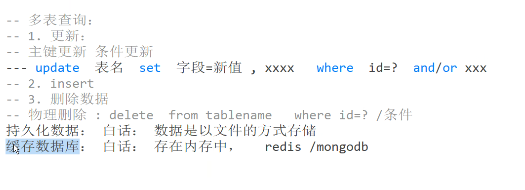

# SQL 数据库-技术

# SQL 数据库-技术

## 多表查询

### 数据库类别、更新



### 查询条件


### 左右连接查询


### 子查询


在 SQL 中，**子查询（Subquery）** 是指嵌套在另一个查询语句中的查询。

允许出现在：

```sql
SELECT
FROM
WHERE
```

其结果可以被当作“字段”或“表”来使用。

- 字段
- 表

我们分别来看这两种情况：

---

#### ✅ 一、子查询作为“字段”使用

这类子查询通常返回单个值，用于 SELECT 列表中作为表达式的一部分。

##### 示例：

```sql
SELECT
    employee_id,
    (SELECT department_name FROM departments WHERE department_id = employees.department_id) AS department_name
FROM
    employees;
```

- 子查询 `(SELECT department_name ...)`​ 返回一个值（部门名称），作为 `department_name` 字段。
- 这种类型的子查询必须只返回一个值，否则会报错（除非用聚合函数如 `MAX`​, `MIN` 等保证唯一性）。

---

#### ✅ 二、子查询作为“表”使用（派生表）

这种情况下，子查询的结果是一个“虚拟表”，可以在外部查询的 `FROM` 子句中使用。

##### 示例：

```sql
SELECT *
FROM (
    SELECT department_id, COUNT(*) AS num_employees
    FROM employees
    GROUP BY department_id
) AS dept_stats
WHERE num_employees > 5;
```

- 内部查询生成了一个临时表 `dept_stats`，包含每个部门的员工数。
- 外部查询对这个临时表进行过滤操作。

📌 **注意：**

- 子查询作为表时，最好为它指定别名（如 `AS dept_stats`）。
- 某些数据库（如 MySQL）要求必须给子查询起别名。

---

#### 🔍 小技巧：

- 可以在 `WHERE` 中使用子查询来筛选数据，例如：

  ```sql
  SELECT * FROM employees
  WHERE salary > (
      SELECT AVG(salary) FROM employees
  );
  ```

- 子查询可以嵌套多层，但为了可读性，建议控制嵌套深度或改写成 `JOIN`。

---

#### 🧠 总结对比：

| 使用方式 | 出现场景      | 返回值类型 | 是否需要别名 |
| -------- | ------------- | ---------- | ------------ |
| 作为字段 | SELECT 列表中 | 单个值     | 否           |
| 作为表   | FROM 子句中   | 整张虚拟表 | 是（推荐）   |

---

‍
