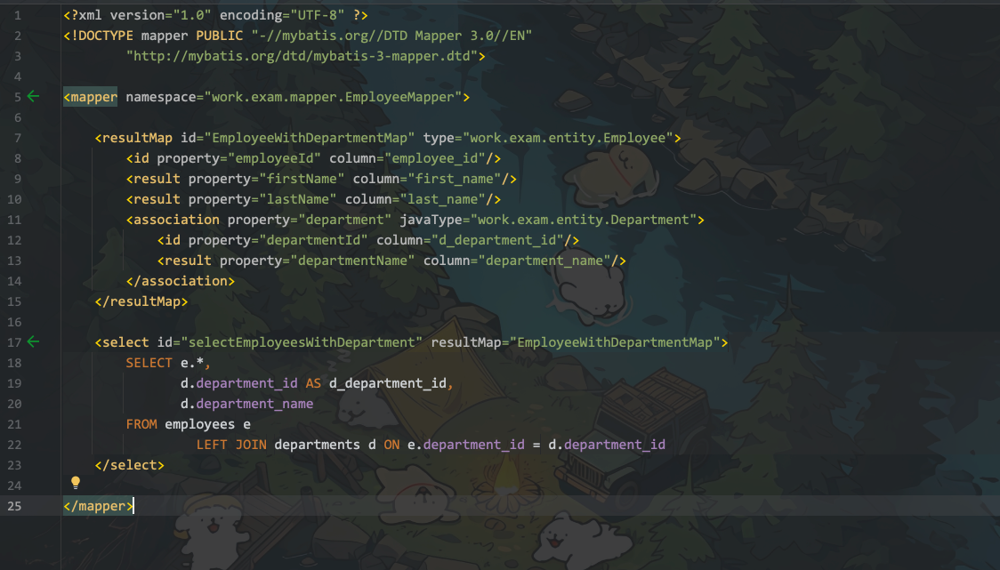
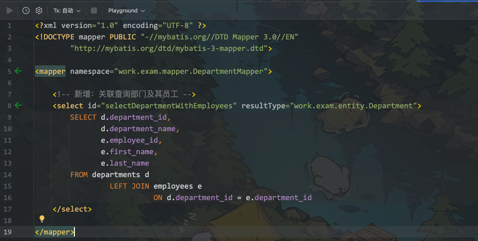
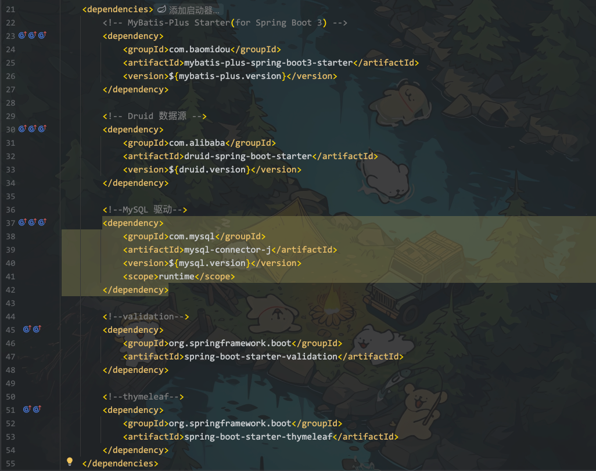

# 第一次考试

# 第一次考试

## 一、考试内容

## 中间件

| 项目   | 信息   |
| ------ | ------ |
| 服务器 | 无     |
| mysql  | 自己的 |
| redis  | 无     |
| nacos  | 无     |

## 实现要求

### 说明

| 项目     | 信息                                                     |     |
| -------- | -------------------------------------------------------- | --- |
| 时间     | 2.5 小时                                                 |     |
| 开发工具 | idea/ maven                                              |     |
| 技术栈   | springboot （mybatis，mybatisplus, springdataJPA 三选一) |     |
|          |                                                          |     |

> 说明： 开卷

### 验收标准

```
1. 完成代码开发，
2. 完成数据的设计
3. 后台无报错，
4. 所有类要注释要标记自己的名字, 并有相对完整的注释
4. 提交一个压缩包到指定位置
   压缩包名： 学号-原班级_学号_《java提高班》周考
   压缩内容：
   A: 导出的sql
   B：项目打包成的jar包,
   C: 项目主要代码和运行结果的截图
      比如要包括但不限于以下相关截图：
            1.项目运行无异常（控制台截图）
			2.项目结构的截图
			3.Mysql表的截图
			4.Application.properties截图
			5.Maven依赖截图
			6.Api工具测试的截图（CRUD）
```

## 技术要求

| 项目         | 信息           |     |
| ------------ | -------------- | --- |
| API 设计规范 | 采用 rest 风格 |     |
| 数据库       | 合理即可       |     |
| 代码质量     | 合理即可       |     |

```xml
考勤系统中员工和部门的关系表

１.　设计员工和部门表，每张表字段不能少于５个
２.　实现员工表和部门表的ＣＲＵＤ。（要有多表连接）

加分选项：
1. 自己可以发挥想象，添加需求！ 在文档中注明即可！
```

‍

## 二、表结构设计

```sql
-- 创建部门表
CREATE TABLE `departments`
(
    `department_id`   int          NOT NULL AUTO_INCREMENT,
    `department_name` varchar(100) NOT NULL,
    `location`        varchar(100) DEFAULT NULL,
    `manager_name`    varchar(50)  DEFAULT NULL,
    `create_time`     datetime     DEFAULT CURRENT_TIMESTAMP,
    `update_time`     datetime     DEFAULT CURRENT_TIMESTAMP ON UPDATE CURRENT_TIMESTAMP,
    PRIMARY KEY (`department_id`)
) ENGINE = InnoDB
  DEFAULT CHARSET = utf8mb4
  COLLATE = utf8mb4_0900_ai_ci;

-- 创建员工表
CREATE TABLE `employees`
(
    `employee_id`   int         NOT NULL AUTO_INCREMENT,
    `first_name`    varchar(50) NOT NULL,
    `last_name`     varchar(50) NOT NULL,
    `email`         varchar(100) DEFAULT NULL,
    `phone`         varchar(20)  DEFAULT NULL,
    `hire_date`     date         DEFAULT NULL,
    `salary`        double       DEFAULT NULL,
    `department_id` int          DEFAULT NULL,
    `create_time`   datetime     DEFAULT CURRENT_TIMESTAMP,
    `update_time`   datetime     DEFAULT CURRENT_TIMESTAMP ON UPDATE CURRENT_TIMESTAMP,
    PRIMARY KEY (`employee_id`),
    KEY `fk_department` (`department_id`),
    CONSTRAINT `fk_department` FOREIGN KEY (`department_id`) REFERENCES `departments` (`department_id`)
) ENGINE = InnoDB
  DEFAULT CHARSET = utf8mb4
  COLLATE = utf8mb4_0900_ai_ci;
```

### 插入数据

```sql

/*
    数据插入
*/
-- 插入部门数据
INSERT INTO `departments` (`department_name`, `location`, `manager_name`)
VALUES ('研发部', '北京', '张伟'),
       ('市场部', '上海', '李娜'),
       ('人事部', '广州', '王芳'),
       ('财务部', '深圳', '赵强'),
       ('销售部', '杭州', '刘洋');

-- 插入员工数据
INSERT INTO `employees` (`first_name`, `last_name`, `email`, `phone`, `hire_date`, `salary`, `department_id`)
VALUES ('张', '伟', 'zhang.wei@example.com', '13800138001', '2020-01-15', 15000, 1),
       ('李', '娜', 'li.na@example.com', '13800138002', '2019-05-20', 12000, 2),
       ('王', '芳', 'wang.fang@example.com', '13800138003', '2018-11-10', 10000, 3),
       ('赵', '强', 'zhao.qiang@example.com', '13800138004', '2021-03-05', 18000, 4),
       ('刘', '洋', 'liu.yang@example.com', '13800138005', '2020-07-22', 16000, 5),
       ('陈', '明', 'chen.ming@example.com', '13800138006', '2021-02-18', 11000, 1),
       ('林', '小', 'lin.xiao@example.com', '13800138007', '2019-08-30', 9500, 2),
       ('黄', '静', 'huang.jing@example.com', '13800138008', '2020-04-12', 8500, 3),
       ('吴', '刚', 'wu.gang@example.com', '13800138009', '2021-01-25', 12500, 4),
       ('周', '红', 'zhou.hong@example.com', '13800138010', '2019-11-05', 13500, 5),
       ('徐', '亮', 'xu.liang@example.com', '13800138011', '2020-09-15', 10500, 1),
       ('孙', '丽', 'sun.li@example.com', '13800138012', '2021-06-20', 11500, 2),
       ('马', '强', 'ma.qiang@example.com', '13800138013', '2019-03-10', 9000, 3),
       ('朱', '华', 'zhu.hua@example.com', '13800138014', '2020-12-05', 14000, 4),
       ('胡', '伟', 'hu.wei@example.com', '13800138015', '2021-05-22', 13000, 5),
       ('高', '峰', 'gao.feng@example.com', '13800138016', '2019-10-18', 9500, 1),
       ('郑', '敏', 'zheng.min@example.com', '13800138017', '2020-07-30', 11000, 2),
       ('梁', '超', 'liang.chao@example.com', '13800138018', '2021-04-12', 8500, 3),
       ('谢', '军', 'xie.jun@example.com', '13800138019', '2019-01-25', 12500, 4),
       ('宋', '娜', 'song.na@example.com', '13800138020', '2020-08-05', 13500, 5),
       ('唐', '杰', 'tang.jie@example.com', '13800138021', '2021-03-15', 10500, 1),
       ('许', '婷', 'xu.ting@example.com', '13800138022', '2019-12-20', 11500, 2),
       ('韩', '强', 'han.qiang@example.com', '13800138023', '2020-05-10', 9000, 3),
       ('冯', '华', 'feng.hua@example.com', '13800138024', '2021-02-05', 14000, 4),
       ('董', '伟', 'dong.wei@example.com', '13800138025', '2019-09-22', 13000, 5),
       ('曹', '峰', 'cao.feng@example.com', '13800138026', '2020-06-18', 9500, 1),
       ('彭', '敏', 'peng.min@example.com', '13800138027', '2021-01-30', 11000, 2),
       ('潘', '超', 'pan.chao@example.com', '13800138028', '2019-08-12', 8500, 3),
       ('袁', '军', 'yuan.jun@example.com', '13800138029', '2020-03-25', 12500, 4),
       ('于', '娜', 'yu.na@example.com', '13800138030', '2021-10-05', 13500, 5);
```

## 三、实体类编写

```java
package work.exam.entity;

import com.baomidou.mybatisplus.annotation.*;
import lombok.Data;

import java.util.Date;
import java.util.List;

/**
 * 部门实体类
 * 作者：李潞
 * 对应数据库中的departments表
 */
@Data
@TableName("departments")
public class Department {
    @TableId(type = IdType.AUTO)
    /**
     * 部门ID，主键
     */
    private Integer departmentId;

    /**
     * 部门名称
     */
    private String departmentName;

    /**
     * 部门位置
     */
    private String location;

    private String managerName;

    @TableField(fill = FieldFill.INSERT)
    private Date createTime;

    @TableField(fill = FieldFill.INSERT_UPDATE)
    private Date updateTime;

    @TableField(exist = false) // 一对多关联
    private List<Employee> employees;
}

```

```java
package work.exam.entity;

import com.baomidou.mybatisplus.annotation.*;
import lombok.Data;

import java.util.Date;
/**
 * 员工实体类
 * 作者：李潞
 * 对应数据库中的employees表
 */

@Data
@TableName("employees")
public class Employee {
    @TableId(type = IdType.AUTO)
    /**
     * 员工ID，主键
     */
    private Integer employeeId;

    /**
     * 员工名字
     */
    private String firstName;

    /**
     * 员工姓氏
     */
    private String lastName;

    /**
     * 邮箱地址
     */
    private String email;

    private String phone;

    private Date hireDate;

    private Double salary;

    @TableField("department_id")
    private Integer departmentId;

    @TableField(fill = FieldFill.INSERT)
    private Date createTime;

    @TableField(fill = FieldFill.INSERT_UPDATE)
    private Date updateTime;

    @TableField(exist = false) // 一对一关联（部门信息）
    private Department department;
}
```

### application.yaml

```yaml
# Server Configuration
server:
  port: 8080

# Logging Configuration
logging:
  level:
    work:
      mapper: debug
      service: info
      controller: info

# Active Profile
spring:
  profiles:
    active: dev
  main:
    allow-circular-references: true

  #DataSource Configuration (Druid)
  datasource:
    url: jdbc:mysql://${fromsko.datasource.host}:${fromsko.datasource.port}/${fromsko.datasource.database}?serverTimezone=Asia/Shanghai&useUnicode=true&characterEncoding=utf-8&zeroDateTimeBehavior=convertToNull&useSSL=false&allowPublicKeyRetrieval=true
    username: ${fromsko.datasource.username}
    password: ${fromsko.datasource.password}
    driver-class-name: ${fromsko.datasource.driver-class-name}

  # close thymeleaf cache
  thymeleaf:
    cache: false

mybatis-plus:
  configuration:
    # MyBatis 配置
    map-underscore-to-camel-case: true
  global-config:
    # 全局配置
    db-config:
      # 数据库配置
      id-type: auto
  mapper-locations: classpath:/mapper/*.xml
  type-aliases-package: work.exam.entity

# application-dev.yaml
fromsko:
  datasource:
    driver-class-name: com.mysql.cj.jdbc.Driver
    host: localhost
    port: 3306
    database: attendance_system
    username: root
    password: root
```

‍

## 四、核心

### Mapper

> 采用 Mybaits-plus 并增加如下接口





### pom.xml

> 使用的 父子工程




## 五、运行截图

### 目录


### 接口


