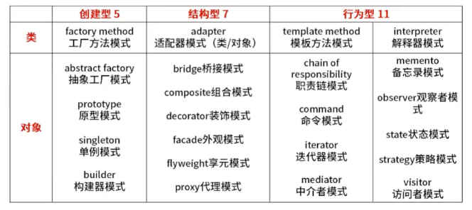
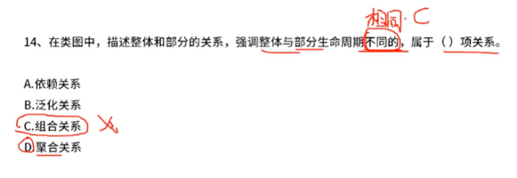
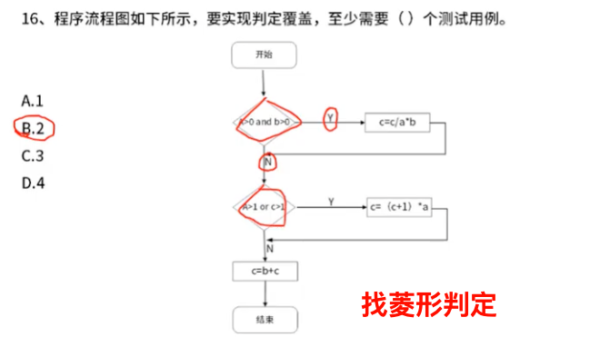
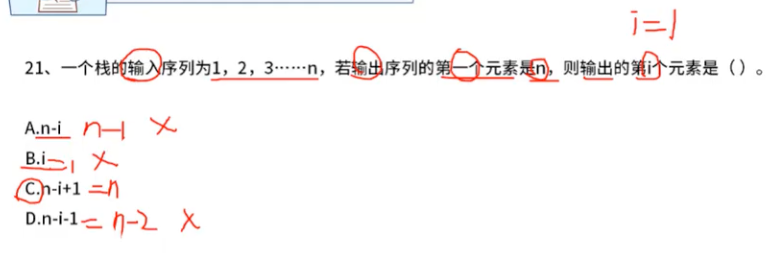
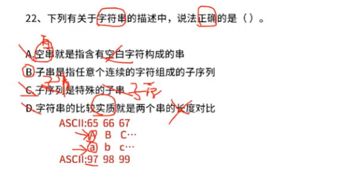
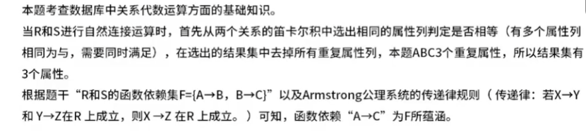

# 02-软件设计师中级

# 02-软件设计师中级

> like 固定搭配 %%

> 数据库设计阶段

> 设计模式，类型

> 类图-关系

> 多态

> 流程图判定

> 白盒测试：是否能够执行，判断动静态

> 数据流图

> 图-有向图 9 条边看几个数字 -入度竖看，出度横看，无向图是斜对称

> 二叉树绘制
>
> - 不是完全
> - 层数 4
> - 叶子 3
> - 后序遍历（先左后右再根）：

> 栈

> 字符串

> 存储

> 磁盘清理

> PV-原语操作

> 候选关键字

> 数据库中关系代数运算：笛卡尔积
> 自然连接基于相同属性名（A,B,C）进行连接
>
> 1. **自然连接属性数**：结果为两关系属性并集，重复属性只保留一个。
> 2. **传递依赖**：若存在 A→B 且 B→C，则必然存在传递依赖 A→C。

> 数据库 E-R 模型

> 机器码

> 软件著作，专利权

‍
